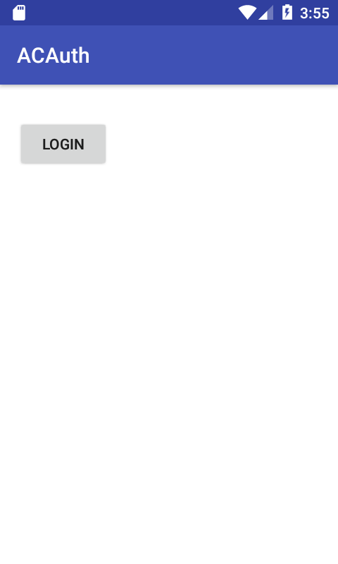
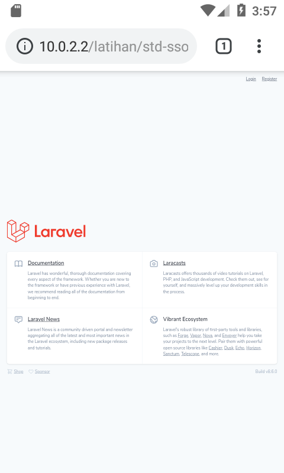
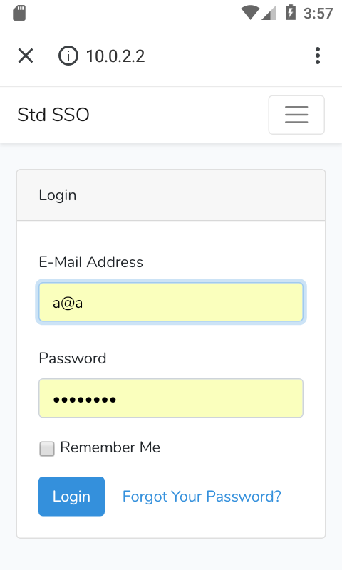
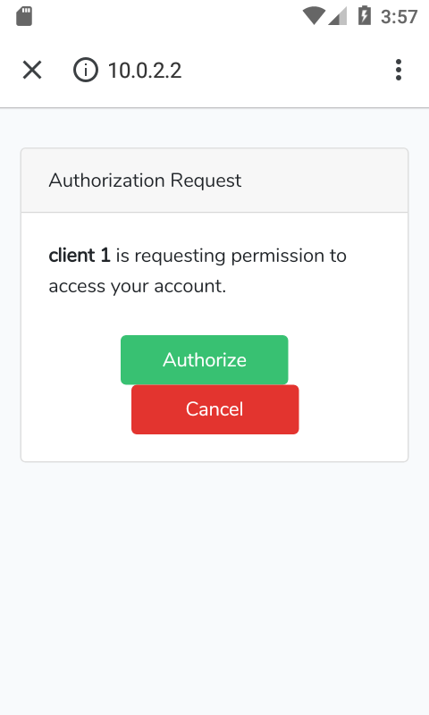
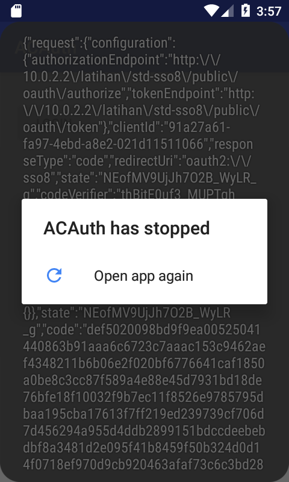
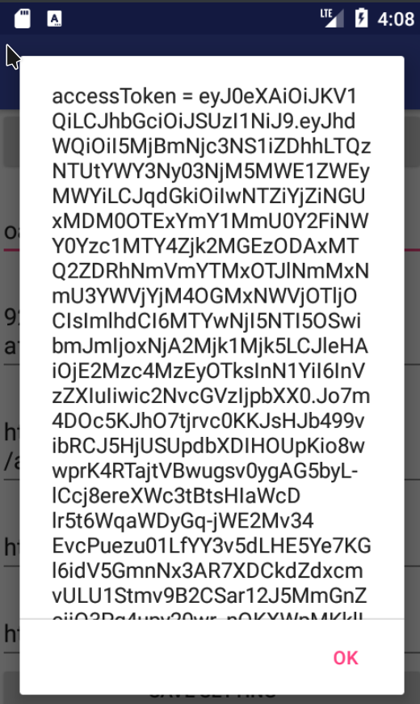
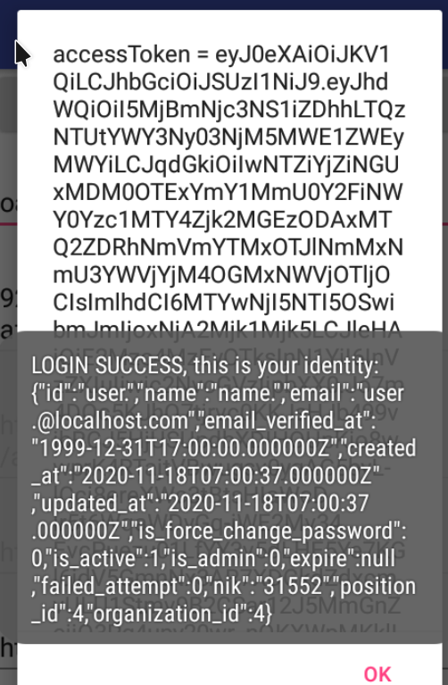

# Android OAuth Example

## About
- forked from https://github.com/artikcloud/tutorial-android-OAuthStarterCode
- changed to show how to implement OAuth2 login on Android
- please view original README.md in README_original.md
- please note that this app's purpose is purely made to be educational, demonstration, or proof-of-concept of how to integrate OAuth2 single-sign-on with android application

## Changes
- target API level to API 24 (Android 7.0 Nougat)
- fix some gradle script (so that it compiles)
- auth redirect URL changed to: ```oauth2://sso8```
- allow cleartext (HTTP), and point oauth2 token endpoint to 10.0.2.2 (host of android studio's localhost)
- set app to 'Toast' the auth code after getting callback
- add example to consume basic API 'whoami', the API needs ```Authentication: Bearer ...``` HTTP header, and returns user's attribute in JSON format; with volley as HTTP request library

## Notes
- the OAuth2 server-side uses php (laravel-passport) on laravel 8 (hence ```sso8``` naming)
- in order to make laravel-passport works with "Authorization Code Grant with PKCE", make sure to create the client with ```php artisan passport:client --public``` (or just update the database and set ```oauth_clients.secret``` to NULL), ref: https://laravel.com/docs/8.x/passport#creating-a-auth-pkce-grant-client

## Setup

### OAuth2 server setup
- run OAuth2 server-side (not included in this repository)
- create new client OR edit a client, set it to enable 'PCKE code grant' flow (set as public client)
- set the client's redirect URL to ```oauth2://sso8``` OR any other custom URL value
- get the client's client_id

### Android application setup
- clone this repository
- install android studio
- install required sdk (API level 24 or 30)
- install avd
- edit ```Config.java```: input your client_id and redirect_url (obtained in previous step, example: 91a27a61-fa97-4ebd-a8e2-021d11511066)
- edit ```AuthHelper.java```: input your OAuth2 server's _authorize_ and _token_ endpoint there (example: http://10.0.2.2/myoauth2server/oauth/token)
- run / build
- click "Login" button, and observe the logcat for auth_code, refresh_token, and access_token
- note that the app might crash if your server doesn't use HTTPS or the SSL certificate is invalid

## Screenshots

#### default page 


#### laravel's stock landing page 


#### laravel-ui login page, shown after login button clicked 


#### passport's authorization endpoint 


#### login success, get auth code


#### login success, get access token


#### login success, get user info (from 'whoami' API endpoint, not an OAuth2 standard, just json dump of user attributes)

